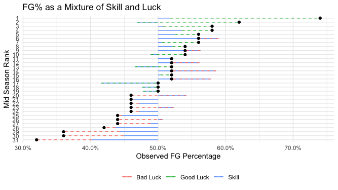
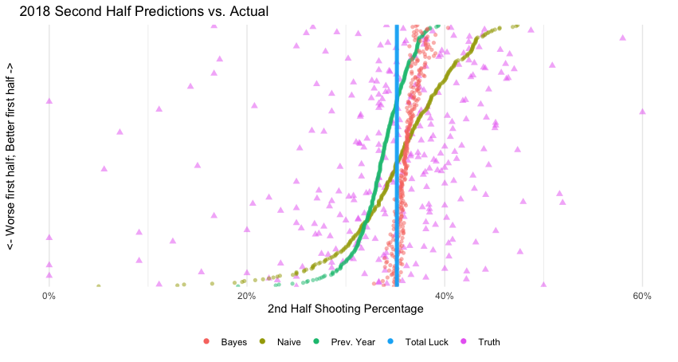
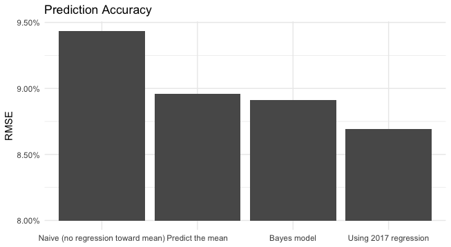

---
output:
  html_document:
    fig_caption: false
---


```{r setup, include=FALSE}
knitr::opts_chunk$set(echo = TRUE)
```

## Predicting Regression toward the Mean Using Hierarchical Bayes




Regression toward the mean is a fascinating topic to me. It's completely ubiquitous across types of measurement, but can be surprisingly subtle in its implications. The reason it's so ubiquitous is that it can be observed in any process that's partially deterministic (e.g. skill) and partially stochastic (e.g. luck). If you make observations on a group of people in two time periods and assume that their skill stays constant but their luck will vary randomly, those who did best in the first time period are likely to not do as well in the second because their luck will run out and someone with similar skill will end up with more luck. Nowhere do we make more observations on groups of people involving skill and luck than in the world of sports. In the example graph above, you notice that despite the true differences in skill among players, most of the green good luck lines cluster toward the top and most of the bad luck red lines cluster toward the bottom. 

#### Modeling regression toward the mean

Lately I've been thinking about how even though it's fairly obvious to expect regression to the mean to happen, it's not nearly as obvious how much regression to the mean to expect. To make it more concrete, suppose I'm interested in how good of a predictor NBA 3 point shooting in the first half of the season is for predicting the second half of the season. It's easy enough to go and look at the last ten years of data and measure the slope of the regression line (about 0.39 depending on which years you use), but suppose instead of the NBA we're working with a new sport and a new league. We still reasonably expect regression toward the mean, but if we've only observed half a season of games, how do we make unbiased predictions of how each player will do in the second half of the season? If we say they will do exactly as well as they did the first half, we will over predict the performance of the best players and under predict the performance of the worst players, predictably! But knowing how much to regress their performance isn't obvious.

How do we address this? If I consider a player in isolation (without knowing anything about the rest of the league) and you ask me to predict his or her performance based on their first half season performance, my best guess is going to be that they continue whatever trajectory they are on (ie. keep the same shooting percentage as before) because I have no reason to suspect that they got particularly lucky or unlucky. But the same reasoning doesn't apply with the additional knowledge of how the rest of the league did. If I know he or she was at the very top of the league in the first half of the season, I have strong reason to suspect that they got more lucky than unlucky. This is because I'm "borrowing" information about how skill is distributed in the league and know that a player exhibiting that much skill without luck is unlikely. Whenever I am borrowing information from other sources to inform your predictions about an individual in that group, hierarchical Bayesian modeling is my go-to approach. 

#### Why modeling beats black box machine learning
Something I love about the 'half season, no historical data' prediction problem is that I think it would cause a lot of trouble for black box machine learning type people. I think without building some modeling assumptions into the problem, a black-box practitioner is either going to say "we don't have the data to predict this" (since it's not a supervised learning problem) or put together some algorithm that basically just predicts a continuation of individual performance without regression, a demonstrably bad prediction! However, by modeling the phenomena we believe to control the outcome, a modeler can in fact get some estimate of regression to the mean.

To build a Bayesian model, we need to identify what sources we think contribute to both the skill and the luck. To motivate this, I will consider predicting the second half of the season 3 point shooting percentage by all NBA players in the 2018 season who had at least 20 attempts in the first half of the season. 

#### The simplest model
I will show the simplest reasonable model and suggest some alternatives for more complicated models. In the simplest model, we'll assume all three point shots are independent and equally likely to go in given each a player's skill level, s. We'll use the logit link to go from s (the player's skill) to p (the player's probability of making a shot) and set a normal distribution prior on s:

$$
s\sim Normal(\mu, \sigma^2)
$$
We'll use a diffuse hyperprior on $\mu$ and $\sigma$. This model means we expect three point skill to be normally distributed in the NBA, which probably isn't true with all the non-3 point shooting centers, but since we added the caveat that players have to have 20 shot attempts, it appears to be a safe assumption. With the assumptions stated above we have an implied likelihood for each player:

$$
3PT_i \sim binomial(s_i, n_i)
$$
which is simply saying the number of 3 pointers made by player i follows a binomial distribution with $s_i$ as a parameter and $n_i$ as the observed number of shots. We will fit this model, and then use $p_i$ as our predicted three point percentage for any future time period.

#### More complicated models
Other models have different things to say about luck vs. skill. For example, we could build a model that takes into account which teams you've played and which you will play, to adjust for the luck that comes from playing crappy defending teams. Another model that I think would be interesting would be one that doesn't fix your shooting percentage t a certain p, but instead assumes you'll take a random walk around your true skill over the course of a season, so you drift from being really on fire to pretty mediocre. Although many stats people would disagree with this model (smells too much like the hot-hand), anyone who's watched Jordan Clarkson this season will have a hard time believing that players don't have rhythm streaks like this. Any of these adjustments are going to change the relative prediction of how much performance was luck vs. how much was skill, and will thus change our prediction of future performance.

#### Model Results


There's a lot going on in the above graph, so let's unpack it. The yellow points represents how each person shot in the first half of the 2018 season, so it represents our naive prediction if we assume there will be no regression to the mean and all trends will continue as are. The blue line shows the opposite, if we assume 3 pt shooting skill is equal in the league and thus our best prediction of how anyone will do is the overall mean. The green points show the prediction we would give by using historical data. In this case we regressed the 2017 second half shooting on the 2017 first half shooting, and used the model outputs to obtain predictions for 2018. 

The Bayesian model results are shown in red. The first thing to notice is that the predictions don't follow a nice smooth line like the other predictions. This is because the model accounts for sample size. If you have a big sample, it predicts less regression toward the mean (because you've proven you're good, not just lucky). If you have a small sample size, it predicts much more regression toward. The reason why the red and the blue essentially overlap at the bottom of the chart is because the worst shooters in the league rarely shoot, so we have a small sample size and predict much stronger regression toward the mean. Overall, the red line shows much more regression toward the mean than either the naive prediction or the prediction using historical data. Given the scatter of the true shooting percentages (in purple) this might not be such a bad thing. It appears that there's a lot of luck in the three point shooting percentage you attain. In fact, the raw correlation between players' first half and second half shooting is only 25%.



This second graph shows the average error for each of our models. Unsurprisingly, this shows the model that uses historical data did substantially better than the others. This is not surprising--we should always use historical data when we have it! The model with historical data is much more robust because we don't have to make many assumptions about the data generating process, just that it will stay constant year to year.

The Bayesian model narrowly edges out the "predict the same percentage for everybody" model. This may seem pretty concerning--you barely beat a model that gives the same output no matter what?! But I actually think this is quite impressive. If you had come to me and asked "we want you to predict shooting percentages for every player in the league for the rest of the season. You can use their current shooting percentage or an identical percentage for everybody, which would you prefer?" There's not a chance in the world that I would have gone with the single percentage model. I would have bet all my money on the naive, no regression model and done horribly. The Bayesian model on the other hand, using no historical data, was able to recognize the fact that luck is a strong explanation for these shooting percentages and much more strongly regressed the percentages towards the mean than I would have if I had been the one making the predictions. 

If I was publishing this in an academic journal, this is the part where I would dive into a bunch of simulation studies proving this is a good methodology and testing robustness to different priors and so forth. If I was a sports analyst I would use this to make a bunch of bold predictions about how different players would fare in the next month. Instead I'll just point you to my [Github](https://www.github.com/jntrcs) for the code and invite you to leave a comment if you have any thoughts about how this could be improved or what data you'd be interested in applying it to! Be warned, the code isn't pretty. I really wanted to wrap my mind around the math of the model I was proposing so instead of using Stan I rolled my own Metropolis-Hastings algorithm, and it's not pretty (or efficient)!
